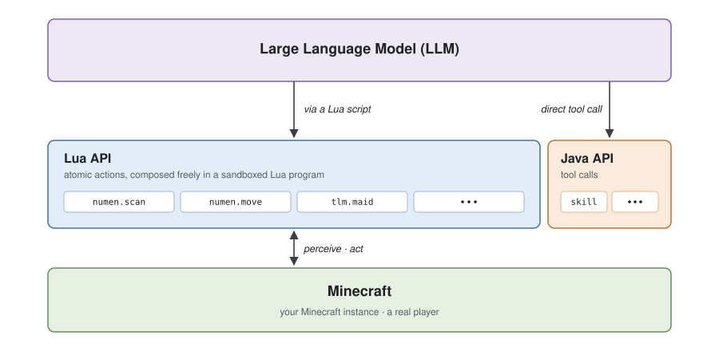

# MineAI

**A Minecraft agent forked from [Numen](https://github.com/Dwinovo/minecraft-numen)**

[**English**](README_EN.md) · [简体中文](README.md)

<a href="#installation">Installation</a> · <a href="#getting-started">Getting Started</a> · <a href="#built-in-integrations">Built-in Integrations</a> · <a href="#architecture">Architecture</a> · <a href="#license">License</a>

MineAI is an **embodied agent that runs inside Minecraft**. It lives in the game as a mod and controls a real
player: it perceives the world, plans, and carries out tasks — travelling, mining, building, fighting, crafting,
and using containers and machines. The engine, the Lua program interface, skills and the external-brain mode all
come from the upstream project [Numen](https://github.com/Dwinovo/minecraft-numen); this repository builds on top
of it with **integrations and enhancements aimed at technology modpacks**.

## Relation to upstream

MineAI is a fork of Numen and tracks its latest architecture. The difference is concentrated in one thing:
*actually being able to use technology mods*.

- It is built on upstream's latest **Lua program model** (the model writes Lua programs that run in a sandbox and
  freely combine atomic actions, completing dozens of steps in a single call);
- it fills in the `plugins/` integrations for technology modpacks, exposed to the model as Lua APIs such as
  `ae2.*`, `mekanism.*` and `jei.*`;
- it adds deterministic **self-verification** and an **offline knowledge base**, so the agent measures the real
  world before drawing conclusions.

For upstream's general capabilities, installation and full architecture, see the
[Numen website](https://numen.dwinovo.cn).

## Installation

MineAI targets **Minecraft 1.21.1 (Fabric / NeoForge, Java 21)**. Install it from this repository's build output:

1. Build with Java 21: `./gradlew :core:neoforge:build` (or `:core:fabric:build`);
2. Drop the jar from `core/neoforge/build/libs/` into your pack's `mods/`;
3. If a target mod (AE2, Mekanism, JEI, ...) is installed, its integration connects automatically; without it,
   nothing breaks.

> The agent's reasoning happens on your own client, and the API key is stored only locally. For multiplayer,
> install it on both the server and each client.

## Getting Started

1. **Set up a model.** In game, press the key that opens the panel (`G` by default; you can change it in the
   controls settings). On the settings page, choose a model provider and enter **your own API key**. Both the
   OpenAI and the Anthropic protocols are supported natively; any compatible provider works by entering its address.
2. **Summon an agent.** Summon an agent from the panel and give it a name.
3. **Start talking.** Tell it what you want done in plain language.

### External Brain

MineAI as a whole can act as an **MCP server** and be driven directly by Claude Code, Codex, Cursor, or any other
MCP client. Reasoning and token usage are then counted against the external agent, so you can drive it with that
client's **subscription plan**, usually cheaper than paying for API calls by usage.

### Controls

| Key | Action |
|---|---|
| `G` | Open the panel |
| `Y` | Type a quick message without opening the panel |
| Hold `R` and scroll the mouse wheel | Choose which agent to talk to when you have several |
| Hold `V` | Voice input; release to send. It does not block WASD movement |

## Built-in Integrations

These integrations load automatically when the target mod is present, all exposed to the model as upstream-style
**Lua API groups** (in a script, `group.fn(...)`):

| Mod | Lua namespace | Capability |
|---|---|---|
| **Applied Energistics 2** | `ae2.network` / `ae2.config` / `ae2.pattern` / `ae2.craft` | Read an ME network (channels / controller / energy / devices); read and write server-side settings of machines and cable parts; encode patterns in the pattern encoding terminal; request autocrafting and query the job |
| **Mekanism** | `mekanism.machine` | Machine state, per-side transmission config, chemical tanks and heat |
| **JEI** | `jei.recipe` | Recipe lookup for an item (made by / used in / catalysts) |

Capabilities that ship with the mod and need no other mod:

- **Self-verification `numen.verify`**: the deterministic checks `have` / `block` / `near` measure a one-line claim
  against the authoritative server state. A long-term goal is checked before it clears; if the claim does not hold,
  the agent continues with the real difference.
- **Offline knowledge base `numen.kb`**: indexes GuideME / Patchouli / FTB quest text; `kb.search` looks it up
  locally for the model to consult the pack's own documentation.

For the latest functions and return values, trust the API index the model actually sees (`numen.api`).

## Architecture

  

The architecture is organized into three layers, from the bottom up. The bottom layer is **Minecraft**, where the
agent controls a real player. The middle layer is the interface opened to the large language model; its main part
is the **Lua API** made of **atomic actions** (perception, movement, digging, building, interaction, which other
mods can plug into), plus a small **Java API** provided as tool calls. The top layer is the **large language
model**, which writes Lua programs that run in a sandbox and freely combine atomic actions, completing dozens of
steps in a single call. See the [upstream website](https://numen.dwinovo.cn) for the full architecture.

## Plugins

Any developer can register new Lua APIs with the agent through a plugin, teaching it to use other mods. The
`plugins/` directory of this repository contains both inherited integrations (Yes Steve Model, Touhou Little Maid,
Curios, FTB Quests, Kaleidoscope, ...) and the technology-mod integrations added here, which can serve as reference
templates for writing your own.

## FAQ

**Is my API key safe?**
Yes. Reasoning happens on your own client, and the API key is stored only locally and sent directly to the model
provider you chose. It never passes through any third-party server.

**Does it work on multiplayer servers?**
Yes. Install it on both the server and each client; each player uses their own API key and drives their own agents.

**Does it cost money?**
MineAI itself is open source and free; calls to the large language model depend on the model provider you choose.

**How is it different from upstream Numen?**
MineAI tracks the upstream architecture and mainly adds technology-modpack integrations, self-verification and an
offline knowledge base on top of it. For general capabilities, upstream is the reference.

## License

The source code is released under [LGPL-3.0](LICENSE); plugins that use the project through its API are not bound
by it. Screenshots, the demo animation and diagrams are released under
[CC BY 4.0](https://creativecommons.org/licenses/by/4.0/), and all other art is reserved. See
[licenses/ASSETS.txt](licenses/ASSETS.txt) for details.

## Acknowledgements

This project is forked from [Numen](https://github.com/Dwinovo/minecraft-numen) (by dwinovo and its
[contributors](https://github.com/Dwinovo/minecraft-numen/graphs/contributors)), to whom we are grateful. For the
open-source projects and research it builds on, see the upstream website.
